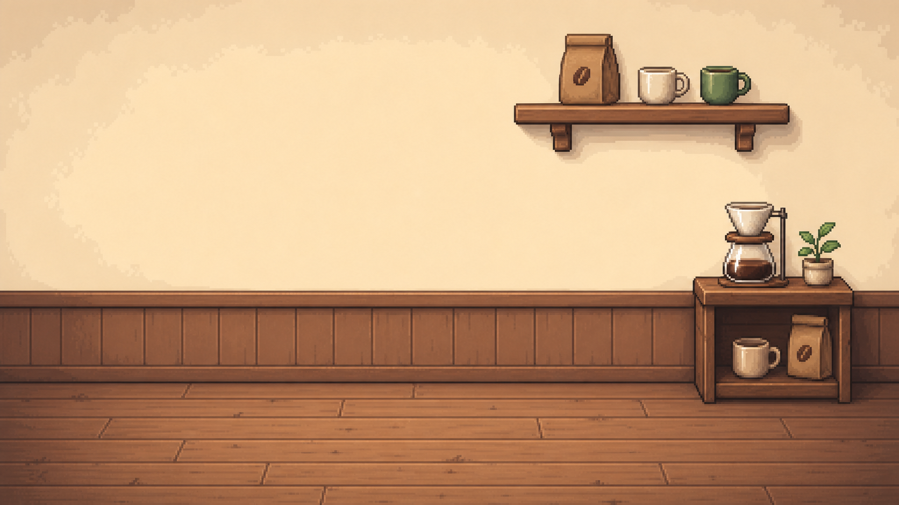
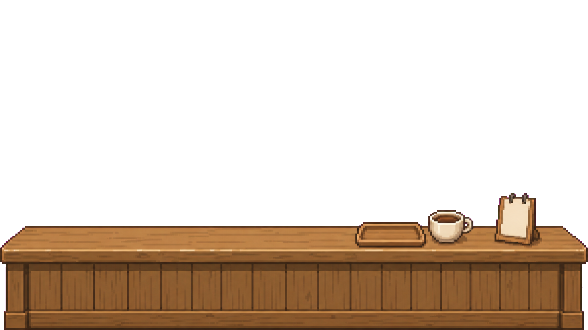

# カフェ内装レイヤー素材仕様書

## 結論

カフェ内装は、1枚絵ではなくレイヤー素材で管理する。  
豆福は最前面に置かず、背景レイヤーとカウンター前面レイヤーの間に配置する。

採用する重なり順はこれ。

```text
奥
1. 背景レイヤー
2. 豆福キャラクター
3. カウンター前面レイヤー
手前
```

この構成にすると、豆福がカウンターの後ろに立っているように見える。

## 目的

- カフェ内装を今のHTML/CSS描画よりおしゃれにする
- 豆福と背景の前後関係を自然にする
- 内装Lv1〜Lv5の成長を分かりやすくする
- 将来、家具追加や部屋カスタムに拡張しやすくする

## 基本方針

- カフェ内装は画像素材で表現する
- 豆福は既存のキャラクターPNGを使う
- 内装画像には豆福を描き込まない
- 内装画像には文字を入れない
- Lv1〜Lv5を別素材として管理する
- 豆福レベルと内装レベルは連動させない

## レイヤー構成

## 1. 背景レイヤー

ファイル名:

```text
cafe-lv1-back.png
cafe-lv2-back.png
cafe-lv3-back.png
cafe-lv4-back.png
cafe-lv5-back.png
```

含めるもの:

- 壁
- 床
- 窓
- 棚
- 照明
- 奥側の機材
- メニュー板
- 観葉植物
- 奥側の小物

含めないもの:

- 豆福
- カウンター前面
- 手前に被る家具
- 画像内テキスト

## 2. キャラクターレイヤー

既存の豆福画像を使う。

```text
assets/characters/mamefuku/mamefuku-lv1.png
assets/characters/mamefuku/mamefuku-lv2.png
assets/characters/mamefuku/mamefuku-lv3.png
assets/characters/mamefuku/mamefuku-lv4.png
assets/characters/mamefuku/mamefuku-lv5.png
```

配置ルール:

- 背景レイヤーの上に置く
- カウンター前面レイヤーの下に置く
- カウンターで豆福の下半身が自然に隠れてよい
- 豆福の顔と上半身は見えるようにする
- スマホ表示でも顔が小さくなりすぎないようにする

## 3. カウンター前面レイヤー

ファイル名:

```text
cafe-lv1-front.png
cafe-lv2-front.png
cafe-lv3-front.png
cafe-lv4-front.png
cafe-lv5-front.png
```

含めるもの:

- カウンター前面
- 手前の影
- カウンター手前の装飾
- 手前に被る小物

条件:

- 透過PNGにする
- カウンター以外の余白は透明にする
- 豆福の胴体下部に自然に重なる高さにする
- 文字を入れない

## 保存場所

```text
assets/interiors/cafe/
├─ cafe-lv1-back.png
├─ cafe-lv1-front.png
├─ cafe-lv2-back.png
├─ cafe-lv2-front.png
├─ cafe-lv3-back.png
├─ cafe-lv3-front.png
├─ cafe-lv4-back.png
├─ cafe-lv4-front.png
├─ cafe-lv5-back.png
├─ cafe-lv5-front.png
└─ cafe-interior.json
```

## Lv別の内装方針

## Lv1: 小さな街カフェ

雰囲気:

- まだシンプル
- 木のカウンター
- ドリップコーヒー器具
- 小さな観葉植物
- 温かい照明

機材:

- ドリッパー
- ポット
- 小さなレジ

## Lv2: 少し整ったカフェ

追加要素:

- テーブル席
- カップ棚
- メニュー板
- 小物を少し増やす

まだ大型機材は置かない。

## Lv3: 豆にこだわるカフェ

追加要素:

- コーヒーグラインダー
- コーヒー豆の袋
- 保存瓶
- 焙煎感のある小物

## Lv4: 本格カフェ

追加要素:

- コンパクトなコーヒーマシン
- ショーケース
- カップや器具の充実
- 照明を少し豪華にする

## Lv5: 人気の本格カフェ

追加要素:

- 大きなLa Marzocco風エスプレッソマシン
- 広いカウンター
- 植物
- あたたかい照明
- 高級感のある棚

注意:

- 「La Marzocco」のロゴや文字は入れない
- 色や形の雰囲気だけを参考にする
- 画像内にブランド名を描かない

## 実装イメージ

HTML構造:

```html
<section class="cafe-scene interior-1">
  
  
  
</section>
```

CSSの重なり順:

```css
.interior-back {
  z-index: 1;
}

.mamefuku-image {
  z-index: 2;
}

.interior-front {
  z-index: 3;
}
```

## JSON管理案

```json
{
  "id": "cafe",
  "levels": [
    {
      "level": 1,
      "requiredClears": 0,
      "back": "assets/interiors/cafe/cafe-lv1-back.png",
      "front": "assets/interiors/cafe/cafe-lv1-front.png"
    },
    {
      "level": 2,
      "requiredClears": 3,
      "back": "assets/interiors/cafe/cafe-lv2-back.png",
      "front": "assets/interiors/cafe/cafe-lv2-front.png"
    },
    {
      "level": 3,
      "requiredClears": 7,
      "back": "assets/interiors/cafe/cafe-lv3-back.png",
      "front": "assets/interiors/cafe/cafe-lv3-front.png"
    },
    {
      "level": 4,
      "requiredClears": 12,
      "back": "assets/interiors/cafe/cafe-lv4-back.png",
      "front": "assets/interiors/cafe/cafe-lv4-front.png"
    },
    {
      "level": 5,
      "requiredClears": 18,
      "back": "assets/interiors/cafe/cafe-lv5-back.png",
      "front": "assets/interiors/cafe/cafe-lv5-front.png"
    }
  ]
}
```

## 画像生成時の条件

共通条件:

- 街カフェ風
- ドット絵ゲーム背景
- 温かい木目
- 緑をアクセントに使う
- 横長の部屋カット
- 文字なし
- 豆福なし
- 人物なし
- ロゴなし
- ブランド名なし

背景レイヤー条件:

- 不透明PNGでよい
- 壁・床・奥側設備を描く
- 豆福を置く中央付近は見やすく空ける

前面レイヤー条件:

- 透過PNG
- カウンター前面だけを描く
- 豆福の下半身を自然に隠す高さにする
- 余白は透明にする

## 受け入れ条件

- 豆福がカウンターの後ろにいるように見える
- 豆福が最前面に浮いて見えない
- カウンター前面が豆福の下半身に自然に重なる
- Lv1〜Lv5で内装の成長が分かる
- Lv5に大型エスプレッソマシンがある
- 画像内に文字・ロゴ・ブランド名がない
- スマホ幅でも主役が見える

## まだ実装しないこと

- 家具の自由配置
- 部屋カスタマイズ
- アニメーション付き家具
- 豆福の位置をユーザーが動かす機能
